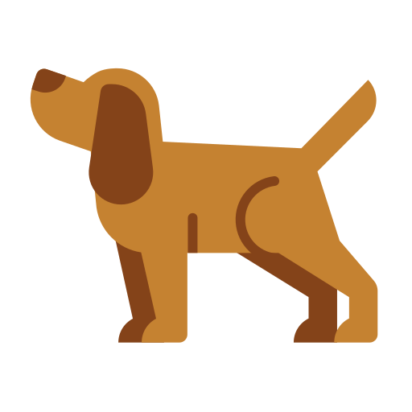

# 🐕 Tazk

> Lightweight, agnostic, fast and easy task runner

**Tazk** is a modern task runner built in Rust that brings speed, simplicity, and flexibility to your development workflow. Define tasks in TOML, YAML, or JSON, and watch them execute with beautiful, colorized output.

## ✨ Features

- 🚀 **Blazingly Fast** - Written in Rust for maximum performance
- 📄 **Multiple Formats** - Support for TOML, YAML, and JSON configuration files
- 👀 **File Watching** - Automatic task re-execution on file changes
- 🎯 **Smart Dependencies** - Topological sorting ensures correct execution order
- 🔄 **Propagation** - Changes can trigger dependent tasks automatically  
- ⚡ **Concurrent Execution** - Run commands in parallel when possible
- 🎨 **Beautiful Output** - Colorized logs with Unicode symbols
- 🛡️ **Cycle Detection** - Prevents infinite loops in task dependencies
- 🌍 **Cross Platform** - Works on Linux, macOS, and Windows

---

## 📦 Installation

### Cargo (Rust)
```bash
cargo install tazk
```

### npm (Node.js)
```bash
npm install -g tazk-bin
```

### Pre-built Binaries

Download the latest release from [GitHub Releases](https://github.com/nehu3n/tazk/releases)

---

## 🚀 Quick Start

Create a `tasks.toml` file in your project root:

```toml
[config]
default = "hello"

[tasks.hello]
cmd = "echo hello world!"
desc = "print a greeting"

[tasks.goodbye]
cmd = "echo goodbye!"
```

Run your tasks:

```bash
# Run the default task
tazk

# Run a specific task
tazk goodbye

# List all available tasks
tazk --list

# Use a custom config file
tazk --file my-tasks.yaml build
```

---

## 📋 Configuration

Tazk supports three configuration formats:

### TOML (tasks.toml)
```toml
[config]
default = "build"
concurrent = true

[tasks.build]
cmd = "echo Building..."
desc = "Build the project"
deps = ["clean"]
watch = ["src/*.rs"]
watch_debounce = 500
watch_propagate = true
concurrent = false
env = { NODE_ENV = "production" }
```

### YAML (tasks.yaml)
```yaml
config:
  default: build
  concurrent: true

tasks:
  build:
    cmd: echo Building...
    desc: Build the project
    deps: [clean]
    watch: [src/*.rs]
    watch_debounce: 500
    watch_propagate: true
    concurrent: false
    env:
      NODE_ENV: production
```

### JSON (tasks.json)
```json
{
  "config": {
    "default": "build",
    "concurrent": true
  },
  "tasks": {
    "build": {
      "cmd": "echo Building...",
      "desc": "Build the project",
      "deps": ["clean"],
      "watch": ["src/*.rs"],
      "watch_debounce": 500,
      "watch_propagate": true,
      "concurrent": false,
      "env": {
        "NODE_ENV": "production"
      }
    }
  }
}
```

## ⚙️ Task Options

| Option | Type | Description |
|--------|------|-------------|
| `cmd` | `string \| string[]` | Command(s) to execute |
| `desc` | `string` | Task description |
| `deps` | `string[]` | Task dependencies |
| `watch` | `string[]` | File patterns to watch for changes |
| `watch_debounce` | `number` | Debounce time in milliseconds (default: 500) |
| `watch_propagate` | `boolean` | Trigger dependent tasks on file changes |
| `concurrent` | `boolean` | Override global concurrent setting |
| `env` | `object` | Environment variables |

---

## 🛠️ CLI Options

```
🐕 Tazk - Lightweight, agnostic, fast and easy task runner

Usage: tazk [OPTIONS] [TASK]

Arguments:
  [TASK]  Task to run (uses default if not specified)

Options:
  -f, --file <FILE>  Use a specific tasks file
  -l, --list         List all available tasks
  -h, --help         Print help
  -V, --version      Print version
```

## 🎯 Examples

### Web Development
```toml
[config]
default = "dev"

[tasks.install]
cmd = "npm install"

[tasks.build]
cmd = ["npm run build"]
deps = ["install"]
watch = ["src/**/*", "package.json"]

[tasks.test]
cmd = "npm test"
deps = ["install"]

[tasks.dev]
cmd = "npm run dev"
deps = ["install"]
watch = ["src/**/*"]
watch_propagate = false
```

### Rust Project
```toml
[config]
default = "check"

[tasks.fmt]
cmd = "cargo fmt"

[tasks.clippy]
cmd = "cargo clippy -- -D warnings"
deps = ["fmt"]

[tasks.test]
cmd = "cargo test"
deps = ["clippy"]

[tasks.build]
cmd = "cargo build --release"
deps = ["test"]

[tasks.check]
cmd = "echo All checks passed!"
deps = ["build"]
```

### Docker Workflow
```toml
[tasks.build-image]
cmd = "docker build -t myapp ."
watch = ["Dockerfile", "src/**/*"]

[tasks.run-container]
cmd = "docker run -p 8080:8080 myapp"
deps = ["build-image"]

[tasks.push]
cmd = "docker push myapp:latest"
deps = ["build-image"]
```

---

## 🔍 File Watching

Tazk includes a powerful file watching system:

```toml
[tasks.frontend]
cmd = "npm run build"
watch = [
  "src/**/*.js",
  "src/**/*.css", 
  "public/**/*"
]
watch_debounce = 300
watch_propagate = true
```

- **Glob Patterns**: Use `*` and `**` for flexible file matching
- **Debouncing**: Prevent excessive re-runs during rapid file changes
- **Propagation**: Automatically trigger dependent tasks on changes

## 🤝 Contributing

We welcome contributions! Please see [contributing.md](contributing.md) for details.

1. Fork the repository
2. Create your feature branch (`git checkout -b feature/amazing-feature`)
3. Commit your changes (`git commit -m 'Add some amazing feature'`)
4. Push to the branch (`git push origin feature/amazing-feature`)
5. Open a Pull Request

## 📄 License

This project is licensed under the MIT License - see the [LICENSE](license) file for details.

---
